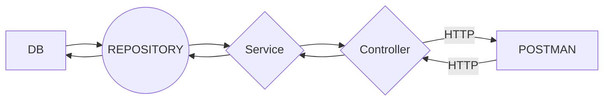

# Intask 
### About 

A Spring Boot application is a Java-based web application framework that provides a comprehensive infrastructure for developing and deploying web applications quickly and easily. The application uses RESTful architecture to expose resources as web services that can be consumed by clients over HTTP.

The application is a to-do list manager with a Board and Tasks. The Board is the main container that holds the tasks. Each task is a separate entity that can be added, modified, or removed. The Board and Tasks are represented as RESTful resources, with each resource having its own URI.

### API endpoints  
#### Login and registration users

| HTTP Method | Endpoint        | Description                      | Example                                           |
|-------------|----------------|----------------------------------|---------------------------------------------------|
| POST        | /api/v1/register | Register user                    | `{"username": "user", "password": "1234"}` |
| POST        | /api/v1/auth    | Authenticate user                | `{"username": "user", "password": "1234"}` |

#### Boards and tasks 
| HTTP Method | Endpoint                          | Description                                             |
| ----------- | -------------------------------- | ------------------------------------------------------- |
| GET         | /api/v1/boards                   | Get all boards belonging to the authenticated user      |
| GET         | /api/v1/boards/{id}              | Get a specific board by ID for the authenticated user   |
| POST        | /api/v1/boards                   | Create a new board for the authenticated user           |
| DELETE      | /api/v1/boards/{id}              | Delete a specific board by ID for the authenticated user|
| PUT         | /api/v1/boards/{id}              | Update a specific board by ID for the authenticated user|
| GET         | /api/v1/boards/{boardId}/tasks/{taskId} | Get a specific task on a specific board for the authenticated user |
| GET         | /api/v1/boards/{id}/tasks        | Get all tasks for a specific board for the authenticated user |
| POST        | /api/v1/boards/{id}/tasks        | Add a new task to a specific board for the authenticated user|
| PUT         | /api/v1/boards/{boardId}/tasks/{taskId} | Update a specific task on a specific board for the authenticated user |
| DELETE      | /api/v1/boards/{boardId}/tasks/{taskId} | Delete a specific task on a specific board for the authenticated user |

### Architecture

### DOCKER CONTAINER setup 
in directory find docker-compose file use it for create container with postman database and spring application 

